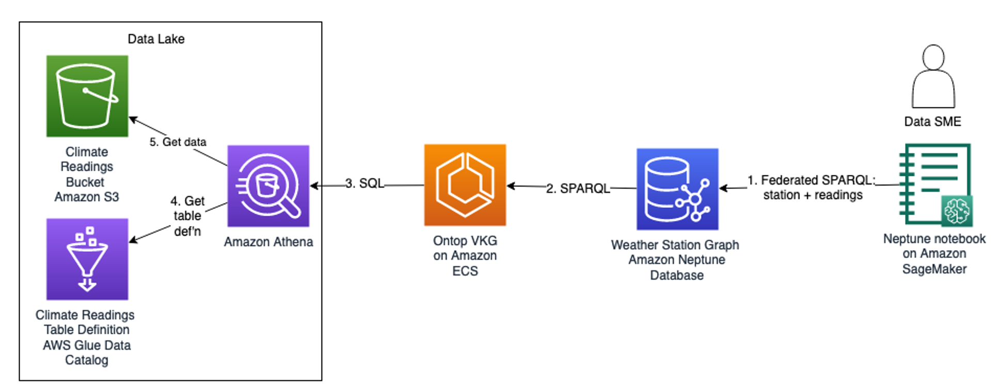

## Graph Virtualization in Amazon Neptune
This repository demonstrates graph virtualization, specifically the ability to run a query against an Amazon Neptune graph database that brings in additional data residing outside the Neptune database in a data lake. In our example, the Neptune database contains a knowledge graph of weather stations, represented in Resource Description Framework (RDF) form. The data lake contains temperature readings from these stations. The readings are not kept in the Neptune database, but we wish to run queries from Neptune that bring in the readings as if they did reside in Neptune. In effect, we want the readings to *virtually* reside in Neptune. 

The next figure shows our design.



First, we decide to split the data as follows. Weather station data goes into a Neptune database. Having it there allows us to maintain relationships between stations and their locations. In general we want to be able to navigate those relationships. 

Neptune supports two well known graph representations: labelled property graph and Resource Description Framework (RDF). In this example, we use RDF. The query language for RDF is called SPARQL.

The readings themselves are collected into an Amazon Simple Storage Service (S3) bucket. This data is huge and grows larger by the minute. The data is in Apache Parquet format. We define a table structure for this data using the AWS Glue Data Catalog. The Amazon Athena service allows us to query the data using SQL. The combination of S3, Glue Data Catalog, and Athena forms a data lake.

Here is the flow:

1. A data SME uses a Neptune Jupyter notebook running on Amazon Sagemaker to explore the Neptune database. In this demo, the SME runs a SPARQL query that combines station and readings data. This is a federated query because it hits not only Neptune but also the lake. Significantly, SPARQL supports federated query in a standard way. We leverage that capability here. The SME runs the query on Neptune. Neptune finds the station data and then implicitly queries the lake to get the readings data. 

2. The data lake can be queried using SQL. It cannot be directly queried using SPARQL. SPARQL federation federates SPARQL endpoints only. But we leverage a third-party tool Ontop Virtual Knowledge Graph (VKG), which maps SPARQL to SQL. It does this by offering a SPARQL endpoint, enabling Neptune to send SPARQL queries to it. We configure Ontop with a mapping, instructing it how to map the incoming SPARQL query to a SQL query.
   
3. Ontop  in turn sends the SQL query to a target database, in this case the data lake via Athena. Ontop uses JDBC, enabling it to connect to a variety of relational databases. We deploy Ontop as a Docker container on Amazon Elastic Container Service (ECS).

4. Athena gets the readings table structure from the Glue data catalog.
5. Athena gets the data from the S3 bucket. 

We are presenting this demo in several public presentations and are writing a post for the AWS Database blog on this topic. We recommend these to better understand the motivation for virtualization and our design.

## Setup Instructions
- Download cfn/ontop_main.yaml
- Go to the CloudFormation console in your AWS account. Create a CloudFormation stack from your local copy of ontop_main.yaml. The stack creates a Neptune cluster, a Neptune notebook, an ECS Cluster, a Glue database and crawler, a Cloud9 IDE, an S3 bucket, and some IAM roles.
- From the Cloud9 console, open the Cloud9 IDE.
- Within the IDE, open a terminal and run the following:

```
# get the code
git clone https://github.com/aws-samples/amazon-neptune-graph-virtualization.git

# make scripts executable
cd amazon-neptune-graph-virtualization/scripts/
chmod +x *.sh

# Copy data files to your bucket. This might take several minutes.
./s3cp.sh <yourstackname>
```

Keep the terminal open. Will come back to this.

- Next, in a separate tab in your browser, go to the Glue console. Under Crawlers, check you have a crawler called ClimateCrawler. Run the crawler. Wait for the crawler to complete.

- Still in Glue console, check Tables under Data Catalog. There should be a table called climate. Confirm.

- Go to the Athena console. Go to the Query Editor. Under Settings, click Manage and set the location for query results to the data bucket created by CFN.

- Still in Athena console, go to the query editor, select the climate table, and run a preview query. Confirm that valid temperature readings comes back in the result set.

- In the Cloud9 IDE, return to the terminal. Run the following:
```

./build.sh <yourstackname>
./deploy.sh <yourstackname> ecs1
```

- In a separate tab in your browser, go to the ECS console. Find the running task for the ontop-lake table. Get its private IP address and copy it.

- In a separate tab in your browser, go to the SageMaker console. Open Jupyter. In Jupyter, open climate-data-queryes.ipynb and replace any IP addresses referenced in the queries with the private IP address of the ECS task. Run the queries. 

## Cleanup
To avoid costs, delete the resources as follows:

- Remove the ECS service containing Ontop by deleting the CloudFormation stack that you created using the deploy.sh step during setup. That stack is based on template cfn/ecs-task.yaml.
- Remove the main CloudFormation stack based on template cfn/ontop_main.yaml. This removes the Neptune cluster and notebook instance, as well as the Cloud9 instance and the ECS cluster.

## Security

See [CONTRIBUTING](CONTRIBUTING.md#security-issue-notifications) for more information.

## License

This library is licensed under the MIT-0 License. See the LICENSE file.

